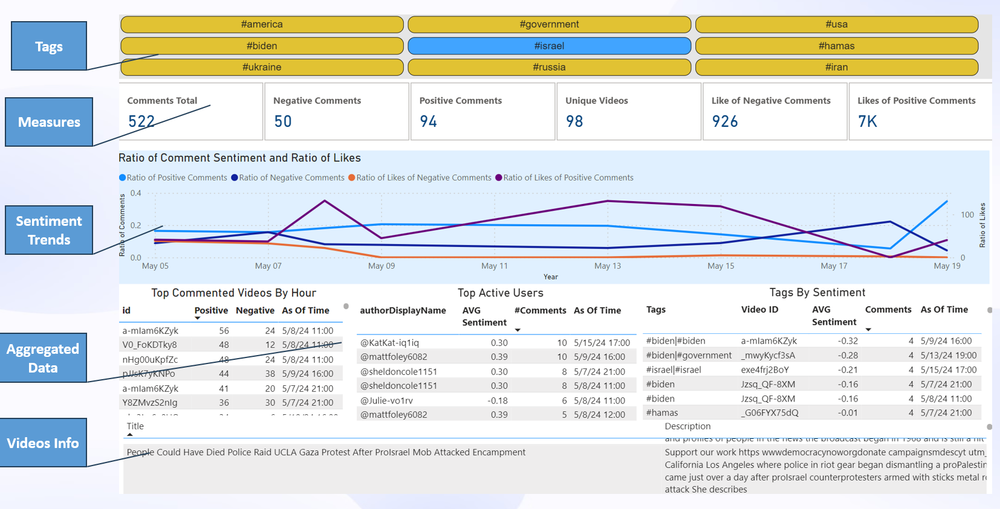

**NAYA College**

**Data Engineering**

**Project:**

**The Commentator Platform**

{width="2.845138888888889in"
height="1.1868055555555554in"}

# Project Primary Assumptions

-   The project runs on the course Docker in GCP.

-   The project is implemented in python code on VS code IDE.

-   The source APIs: YouTube Data API v3.

-   The following services are used for the project solution:

1.  Python scripts for extracting data from API.

2.  Kafka.

3.  Watch dog libraries for monitoring.

4.  Spark and Spark Structure streaming

5.  Storage: HDFS and Mysql.

6.  Visualizations: PowerBI.

7.  Scheduler: Airflow.

# Project High-Level Objectives

## System Architecture

The system architecture leverages the following key components:

-   **YouTube Data API:** This API allows programmatic access to YouTube
    data, enabling the retrieval of video comments for analysis.

-   **Apache Kafka:** A distributed streaming platform that acts as a
    real-time messaging system. Comments retrieved from the YouTube Data
    API are published as messages on a Kafka topic using **Watchdog**
    libraries.

-   **Apache Spark Streaming:** A framework within Spark for processing
    real-time data streams. A Spark Streaming consumer subscribe to the
    Kafka topic containing comments and perform sentiment analysis and
    different aggregations by time window.

-   **Apache Spark:** Apache Spark is used in data pipelines for slowly
    changing data: video info and video transcripts.

-   **Sentiment Analysis Library:** **TextBlob** library is used within
    the Spark Streaming application to analyze the sentiment of comment
    text.

-   **Data Storage:** Raw data and Analysed comments with sentiment
    scores stored in various ways:

    -   **Json Storage:** for raw data extracted from API

    -   **HDFS storage:** for processed data for historical analysis and
        transcript n-gram analysis

-   **Database:** **MySQL** is used to store analysed comments for
    further querying and visualisations.

-   **Data representation:** **Power BI** is used for visualisations.

# Overall Data Flow Summary:

1.  **Airflow** triggers extraction from YouTube API

2.  Data is extracted from YouTube using the YouTube API and stored on
    the **Cloudera** container\'s file system.

3.  A **Kafka** producer script reads the data from the file system and
    sends it to separate Kafka topics based on data type.

4.  **Spark Streaming** applications process comments from the comment's
    topic, perform sentiment analysis, and enrich them with sentiment
    scores.

5.  Enriched comments are further analyzed to generate insights on
    author activity, keyword/phrase trends, and video-level sentiment.

6.  Video transcripts are analyzed on **HDFS** to identify frequent
    bigrams and trigrams.

7.  Sentiment analysis results and other relevant data are persisted in
    a **MySQL** database for further use.

8.  Data streams from various **Kafka** topics are archived as
    **Parquet** files on **HDFS** for efficient storage and analysis.

This multi-stage pipeline enables real-time processing and analysis of
YouTube video comments and associated data, providing valuable insights
for various purposes.

# Project Low-Level Objectives 

{width="6.270138888888889in"
height="5.356944444444444in"}

## Multi-stage data pipeline

The project establishes a multi-stage data pipeline for processing
YouTube video comments and associated data in real-time. Here\'s a
breakdown of the flow:

1.  **Data Acquisition (YouTube API):**

-   A Python script interacts with the YouTube API to fetch data for
    trending videos.

-   Application uses registered API key to get data from Youtube

-   This includes:

    -   **Trending Videos** (can be replaced with videos by search
        criteria) information.

    -   **Comments** of the videos: python script creates request to get
        comments for each video from trending videos list.

    -   **Transcripts** of the video content (if available): similar
        like for comments, python script creates request to get
        transcripts for each video from trending videos list.

-   To overcome limitations of output per request, Python script
    implements **pagination**.

-   Python script **flattening** nested object in API output into 1
    level JSON

-   The script saves the extracted data in JSON format on the GCP file
    system in dedicated folder, that monitored by **Kafka** client as
    described below.

2.  **Data Ingestion to Kafka (Kafka Producer):**

-   Python script utilises a custom KafkaClient class to act as a
    **Kafka** producer.

-   It reads data from the container\'s file system, categorized by
    type:

    -   Comments are stored in a directory named \"Comments\", in
        separate files for each video.

    -   Trending video data resides in a directory named
        \"TrendingVideos\", in separate files for each video.

    -   Transcripts are placed in a directory named \"Transcript\", in
        separate files for each video.

-   The script iterates through each file, treating each
    comment/transcript/video as individual messages with relevant
    metadata.

-   Once a new file is created it's immediately being sent (using python
    **Watch Dog** libraries) to a designated Kafka topic based on its
    content type:

    -   kafka-comments for comments

    -   kafka-video for trending video data

    -   kafka-transcripts for transcripts

3.  **Real-Time Sentiment Analysis (Spark Structured Streaming):**

-   A **Spark Structured Streaming** script continuously processes
    comments received from kafka comments topic.

-   It reads the comments as a **Spark DataFrame** and performs
    sentiment analysis on the comment text.

-   This script enriches the comments by adding sentiment scores
    (positive, negative, or neutral) and extracted for comment body key
    words (also "Tags") by predefined list as additional columns.

-   Finally, the enriched comments are written back to another Kafka
    topic for further processing.

4.  **Downstream Analysis and Storage:**

Here, multiple **Spark Structured Streaming** applications consume
enriched comments data and perform various analyses:

-   **Analysis by Author and Video**

    -   This aggregation focuses on comments with strong sentiment.

    -   It groups comments by author name and video ID, defining
        60-minute time windows for analysis.

    -   Within each window, it calculates the average sentiment and
        total number of comments by an author for a specific video.

    -   It filters out windows with non-significant sentiment and writes
        the aggregated data to dedicated Kafka topic.

-   **Analysis by Keywords and Video**

    -   This aggregation focuses on comments with strong sentiment
        (positive or negative), excluding weak sentiment or comments
        missing relevant keywords.

    -   It groups comments based on extracted keywords/phrases and video
        IDs within 60-minute windows.

    -   It calculates the average sentiment and total number of comments
        for each keyword/phrase within a specific video.

    -   The aggregated data (keywords, video ID, sentiment, comment
        count) is written to dedicated Kafka topic.

-   **Video-Level Sentiment Analysis**

    -   This aggregation processes enriched comments to analyse
        sentiment by the video level.

    -   It groups comments by video ID and defines 60-minute windows.

    -   Within each window, it calculates the sum of positive and
        negative sentiment scores, along with the total comment count.

    -   The script selects and casts relevant data (video ID, sentiment
        sums, total comments, window timestamps) and writes it dedicated
        Kafka topic.

5.  **Data Storage (HDFS):**

-   Data from the following topics is stored on **HDFS**, by **Spark**
    **Kafka Consumer**, each topic in the different folder, for
    persistence and further analysis.

    -   Enriched Comments

    -   Videos

    -   Transcripts

    -   Video-Level Sentiment Analysis

    -   Analysis by Keywords and Video

    -   Analysis by Author and Video

-   The script defines a list of topics and their corresponding schemas
    (data structure definitions).

-   It iterates through each topic:

    -   Reads the data as a Spark DataFrame using the appropriate
        schema.

    -   Writes the DataFrame as Parquet files to HDFS.

Parquet is a columnar format optimized for data warehousing and
analytics. This script essentially facilitates real-time data ingestion
from various Kafka topics (potentially containing comments, video
analytics, transcripts, and trending videos) and stores them efficiently
on HDFS for further analysis.

6.  **N-gram Analysis of Transcripts (HDFS):**

-   A separate Python script analyses video transcripts stored on
    **HDFS** in Parquet format.

-   It focuses on identifying frequent bigrams and trigrams (2-3 word
    combinations) within each video transcript.

-   The script performs the following steps:

    -   Loads the transcript data using **Spark Consumer**.

    -   Iterates through each video ID, processing a maximum of 10,000
        transcript entries -- to prevent memory overloading.

    -   Performs text cleaning by removing stop words.

    -   Utilizes scikit-learn\'s **CountVectorizer** to identify
        frequent bigrams and trigrams.

    -   Creates a DataFrame containing the top 10 most frequent n-grams
        for each video along with their frequencies.

-   Finally, it connects to a **MySQL** database using **SQLAlchemy**
    and stores the results (video ID, top n-grams, frequencies) in the
    dedicated table for further analysis or visualization.

7.  **Data Storage (MySQL):**

-   A Python script implement Kafka consumer to continuously ingest data
    from the Kafka topics and insert each topic into dedicated MySQL
    table. Enable updates, each table has a Primary key, thus every time
    when updated data arriving for previously created records it
    **merges** data using ON DUPLICATE KEY UPDATE MySQL statement.

-   Kafka topics with dedicated MySQL tables

    -   Enriched Comments

    -   Videos

    -   Transcripts (the process implemented separately, by
        **SQLAlchemy)**

    -   Video-Level Sentiment Analysis

    -   Analysis by Keywords and Video

    -   Analysis by Author and Video

8.  **Power BI Dashboards for Enhanced Visualization**

To complement the real-time sentiment analysis and provide interactive
insights, the project was integrated with Power BI dashboards. These
dashboards offer real-time and historical visualizations of key metrics,
facilitating informed decision-making for platform users.

## **Data Representation**

Power BI dashboards provide a user-friendly interface to explore the
extracted sentiment data and gain deeper understanding of audience
reception. Power Bi enables cross filtering between different
representation, tooltips and drill through to get detailed data. Here\'s
a breakdown of dashboards for this project:

{width="6.673958880139982in"
height="3.139991251093613in"}

-   **Tags:** the tags pane enables analysis focusing on specific
    keyword out of predefined list

-   **Measures:** measures with total count of comments and likes with
    breakdown by sentiment and total count of unique videos.

-   **Sentiment Trends:** This dashboard showcases the overall sentiment
    distribution (positive, negative, neutral) for trending videos over
    time. To consider different number of videos over time data is
    represented as ratio: total count of comments with sentiment
    breakdown out of total number of videos and total count of like with
    sentiment breakdown out of total number of comments. Line chart
    enables users to identify trends and fluctuations in audience
    sentiment.

-   **Aggregation #1: Video-Level Sentiment Analysis**

> {width="6.427863079615048in"
> height="3.4731200787401573in"}
>
> This dashboard presents the sentiment breakdown for individual videos.
> While hovering on specific video appears a tooltip with line charts
> track the sentiment fluctuations (positive and negative scores) over
> time, while gauges display the overall sentiment for a specific video
> timeframe.
>
> {width="3.150851924759405in"
> height="2.728248031496063in"}
>
> The drill through enables to get detailed data for specific video.

-   **Video Info drill through**

> {width="3.8852799650043743in"
> height="2.530229658792651in"}
>
> {width="6.270138888888889in"
> height="3.295138888888889in"}
>
> In the details data for specific video appears all relevant data for
> that video:

-   Trends by Hour: comments count by sentiment breakdown by hour

-   **Transcript Top words (N-gram Analysis):** This dashboard showcase
    the most frequent bigrams and trigrams identified within video
    transcripts. Bar charts or word clouds visually represent these
    n-grams, potentially revealing recurring themes or topics within the
    videos.

-   Comments: Detailed data of comments

-   Video Info: Detailed data of videos

-   Top commenters: most active users with total count of comments and
    average sentiment. There is another drill through can be done to get
    more detailed information about specific commenter.

> {width="5.953587051618547in"
> height="2.712050524934383in"}

-   **Commenter info drill through**

> {width="6.270138888888889in"
> height="3.3229166666666665in"}
>
> In this drill through data focused on specific user is represented:

-   Comments trends: average sentiment and total comments count by hour

-   Detailed comment info

-   Detailed video info

<!-- -->

-   **Aggregation #2: Author Activity and Sentiment Analysis**

> {width="6.414406167979003in"
> height="3.4689577865266843in"}
>
> This dashboard focuses on authors with high comment volume or strong
> sentiment. The tooltip displays line charts showing the average
> sentiment score per author by timeframes.
>
> {width="6.270138888888889in"
> height="4.647916666666666in"}
>
> **Aggregation #3: Keyword/Phrase Analysis**
>
> {width="6.166890857392826in"
> height="3.2264227909011374in"}
>
> This dashboard explores the sentiment associated with prominent
> keywords and phrases extracted from comments. It represents tags with
> Average Sentiment and Comments Count by timeline. While hovering on
> Video ID, tooltip with top used words appears.
>
> {width="6.270138888888889in"
> height="3.1659722222222224in"}
>
> By integrating these Power BI dashboards, the project offers a
> comprehensive and interactive visualization layer. Users can explore
> sentiment trends, identify key

# Code reuse and OOP

To enhance code reuse and readability following packages were created:

1.  FromFilesToKafkaProducer

    a.  KafkaClient custom class: used for creating Kafka producers for
        transcripts, comments, videos

2.  StreamingManager: used for creating Spark Structure Streaming
    consumers and producers by following methods:

    a.  readstream_schema_from_topic

    b.  writestream_data_toKafkaTopic

    c.  write_parquet_fromTopic_toHDFS

3.  YouTubeApiExtractor: used for ingestion trending videos list and
    then transcripts and comments for each of them by following methods:

    a.  initDirectories

    b.  createVideosDF

    c.  get_print_transcript

    d.  get_Comments_byVideo_Id

4.  MySQLQueries: used for creating connection to MySQL and management
    dedicated to queries for tables creation and data upserts.

5.  Schemas: used for management schemas that used by Kafka consumers
    for each of topics

6.  Configuration: used for parameters, paths and topics names
    management.

7.  Runner: used for starting all required Kafka Producers and Consumers
    in dedicated threads by single run of this package.

8.  FileManager

    a.  HDFSClient: used for management HDFS file system by the
        following methods

        1.  Makedir

        2.  Removedir

        3.  Initdir

9.  KafkaTopicAdmin: used for management Kafka Topics by following
    methods:

    a.  create_topics

    b.  delete_topics
